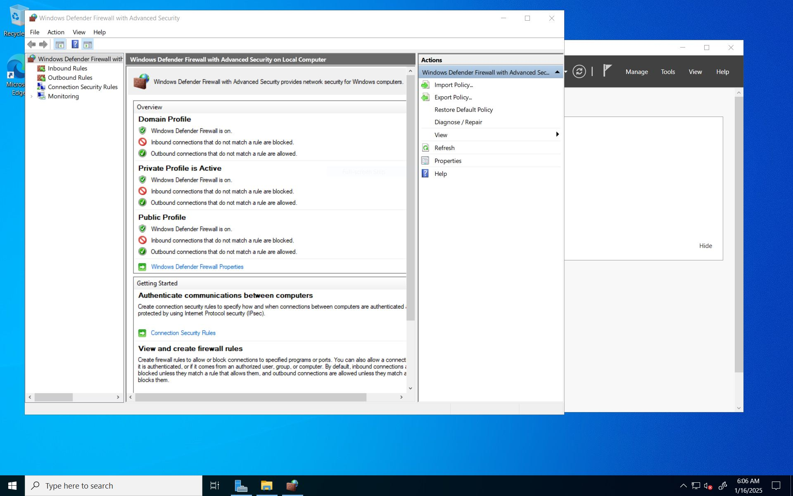

<h1>💻 Preparing Active Directory in Azure</h1> 

<h2>Description</h2> This is part 1 of 3 in building a fully functioning Active Directory server. Part 1 focuses on creating two virtual machines and configuring their networks to prepare the environment for Active Directory.    

<h2>Environments and Utilities Used</h2> 
- <b>Microsoft Azure</b> 
- <b>Virtual Machines</b> 
- <b>Remote Desktop Connection</b> 

<h2>Operating Systems Used</h2> 
- <b>Windows Server</b> 
- <b>Windows 10</b> 

<h2>Project Walk-through</h2> 

<h3>1. Create the Resource Group</h3> 
 

<h3>2. Create a Virtual Network</h3> 

 <b>Note:</b> Ensure that the virtual machines created later are in the same region as this virtual network.

 

<h3>3. Create the First Virtual Machine: Windows Server</h3> 

 <b>Note:</b> Make sure this virtual machine is in the same virtual network created earlier.
 
 
 

<h3>4. Set the Domain Controller’s NIC Private IP Address to Static</h3> 
 
 

<h3>5. Create the Second Virtual Machine: Windows 10 Pro</h3> 

<b>Note:</b> Ensure this VM is also in the same virtual network as the first virtual machine.
 
 
 

<h3>6. Configure DNS Settings for Client-1</h3> 

Set Client-1’s DNS settings to the private IP address of the domain controller (DC-1). Then restart Client-1 from the Azure Portal.
 
 
 
 
 

<h3>7. Disable the Windows Firewall (for Testing Connectivity)</h3> 

Log into the domain controller VM and disable the Windows Firewall.

 

<h3>8. Test Connectivity</h3> 
<ul> 
 <li>Log into Client-1 and attempt to ping DC-1’s private IP address. Ensure the ping is successful.</li> 
 
  
 <li>From Client-1, open PowerShell and run <b>ipconfig /all</b>.</li> <li>Verify that the DNS settings display DC-1’s private IP address.</li> 
  
</ul> 

<h2>🎉 YOU DID IT!</h2> 
Now, the environment is ready to install Active Directory on the domain controller. Proceed to part 2 to continue building your Active Directory server.

